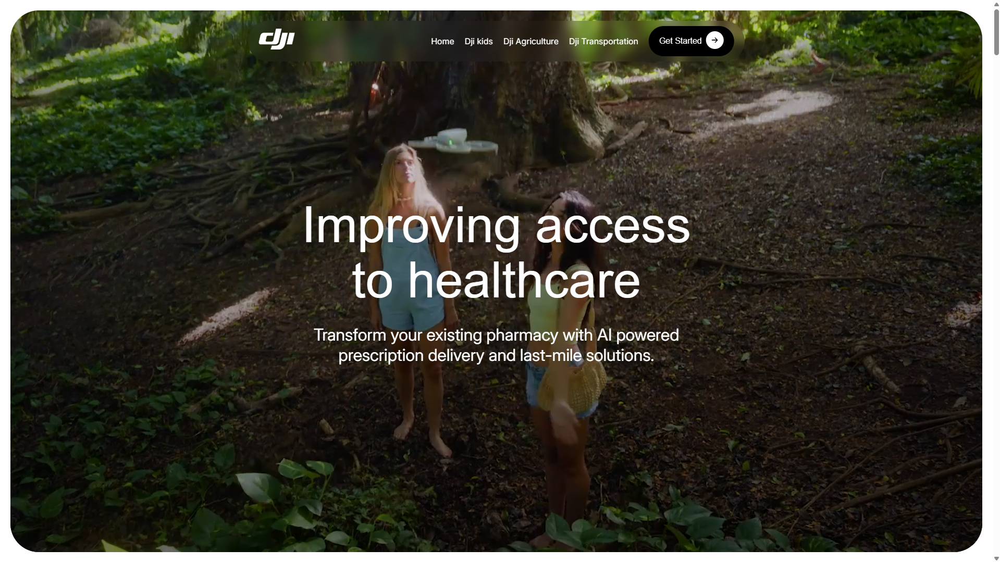

# DJI Design Project

This repository contains a small design project focused on highlighting and enhancing the DJI brand. Through this project, I explored visual and conceptual elements that reflect the innovation and values associated with DJI, contributing to a better understanding and appreciation of the brand and its products.

## Live Demo

Check out the live demo here: [https://sramoras.github.io/djs/](https://sramoras.github.io/djs/)

## Project Objectives

- **Brand Exposure:** Develop a design that emphasizes the innovative and technological aspects linked to DJI.
- **Visual Communication:** Create visual materials that capture the modern and functional aesthetics of the brand, focusing on clarity and visual impact.
- **Innovation:** Showcase how a streamlined design approach with dynamic animations can enhance brand perception.

## Repository Contents

- **/assets:** Images, logos, and other graphic elements used in the project.
- **/docs:** Additional documentation and presentations related to the design and concepts applied.
- **README.md:** This file providing an overview of the project and its specifications.

## Technologies and Tools Used

- **Framework:** React.js for building the project structure and user interface.
- **Animation Library:** GSAP for smooth and advanced animations.
- **Note:** No other tools or frameworks were used in this project.
